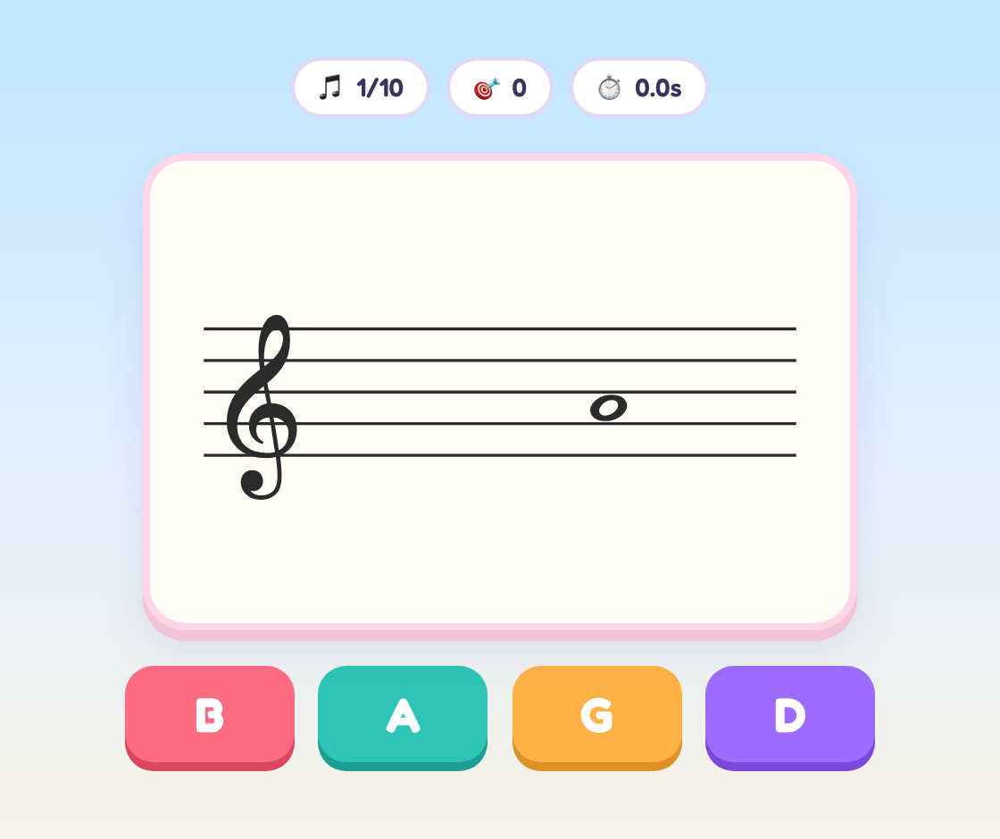

# Note Reading Trainer

A game for learning to read music notation, built with React + TypeScript + Vite.



A note is shown on a staff and you pick its name from four options. Each round
is 10 notes; your score and per-note response time are recorded, and your best
result per mode is saved in the browser (localStorage).

## Modes

- **Treble clef** — C4 to A5 (one ledger line above/below the staff)
- **Bass clef** — E2 to C4
- **Both** — random clef per question

## Levels

- **Easy** — natural notes only
- **Medium** — notes may carry a ♯ or ♭ accidental; answers include the
  accidental (enharmonic oddities like B♯/C♭ are excluded)
- **Hard** — a key signature (up to 4 sharps or flats, G/D/A/E and
  F/B♭/E♭/A♭ major) is drawn on the staff; name the effective pitch of the
  plain note, e.g. an F in D major is F♯

## Development

```sh
npm install
npm run dev      # start dev server at http://localhost:5173
npm run build    # type-check and build for production
```

## Code layout

- `src/notes.ts` — note model, staff-position math, question generation
- `src/Staff.tsx` — SVG rendering of the staff, clef, ledger lines, and note
- `src/App.tsx` — game screens (start / playing / summary), scoring, timing
